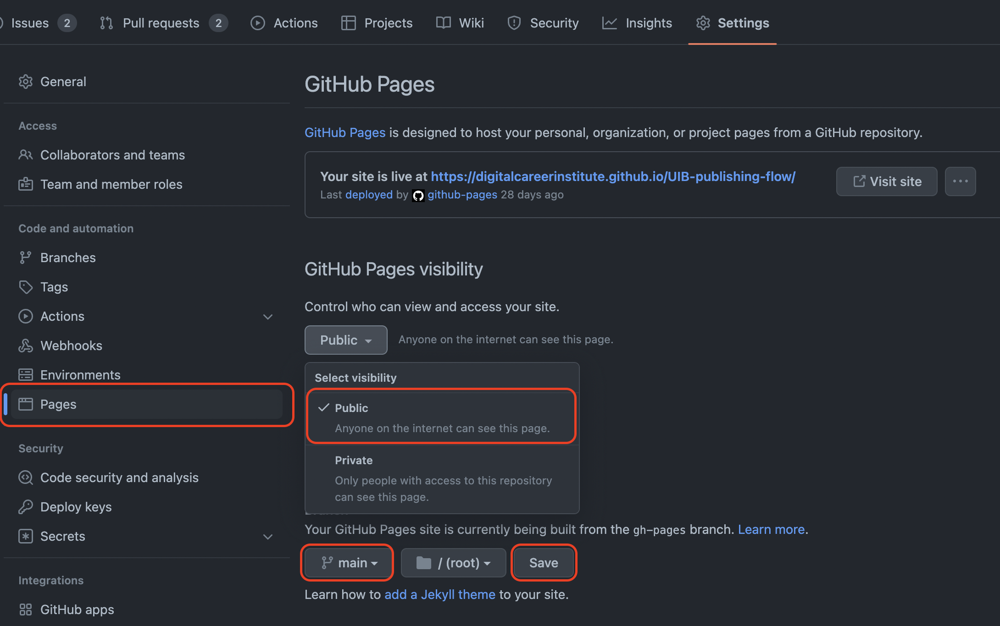

# Publishing Workflow
[](#-results)


Let's make our work public to share it with the world. Use this power wisely and **within legal laws & regulations** (no hate, no bullying, misinformation etc.).

We will use Github's service **Github pages** to publish content of repositories to a publicly accessible URL in the shape of https://accountname.github.io/repositoryname/. 


## Prerequisites
Make sure that you have admin access to this repository. This is needed in order for you to enable GitHub pages.
## Instructions

1. Create an `index.html` file as a starting point and fill it with some boilerplate code (e.g. a document title and a first level heading `<h1>Hello public world</h1>`)
2. Enable GitHub Pages for this repository.
    * See the settings tab of your repository, on the left navigate to the sub menu **Pages**
    * Github will show the URL of your public page on top of the Source section. It will look like https://youraccount.github.io/repositoryname/
3. Visit the public URL (like https://youraccount.github.io/repositoryname/) of and check if everything works like it should.


## CodeBuddy not seeing your deployed page?
* Go to the actions tab
* Click on the title of your last commit
* Select 'Re-run action'

## Bonus: Helper package gh-pages from npm

There is an NPM package `gh-pages` that helps to automate steps for updating your published page, while working from main or other branches.

You may want to install it globally on your system with `npm install -g gh-pages@3.0.0`, to avoid adding a package.json to very basic small projects with pure HTML/CSS.

With the package you can work on your main branch or others, and control what directory you want to publish to the gh-pages branch and become public.

### Call example.

Let's assume you work from the root of your main branch and want to put all it's content into the gh-pages branch and publish it, type:

```bash
gh-pages -d ./
```

You can also decide to specify another sub-directory to become the root of the publication.

```bash
gh-pages -d dist
```

This is useful if you use development tools (like sass) to produce a `/dist/` directory (=distribution) for publishing from other source files.

The content of the subdirectory will become the content of the **root** of the `gh-pages` branch
